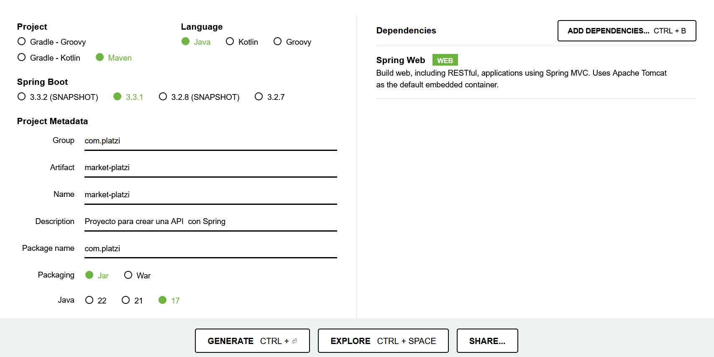

# Curso Spring - Platzi

## Contenedores

Un contenedor es una unidad de software que empaqueta una aplicación junto con:

- Sus dependencias
- Librerías
- Configuraciones
- Datos

en un único paquete facilmente transportable y ejecutable.

### ¿Por qué se crearon?

Los contenedores sirgieron para abordar las necesidad de **aislar** aplicaciones del sistema operativo y permitir que funciones de manera consistente en **diferentes entornos**.

Antes las aplicaciones tenian problemas de:

- Compatibilidad
- Dependian fuertemente de sistema operativo.

### Importancia de los contenedores

**Portabilidad**: Se ejecutan de manera predecible en cualquier entorno, independiente del SO o infraestructura.

**Aislamiento**: Cada contenedor está aislado de los otros, evita conflictos y garantiza que no se afecten entre sí.

**Eficiencia**: Comparten recursos del SO, los hace más livianos y eficientes en comparación con las maquinas virtuales.

**Despliegue Ágil**: Facilitan el despliegue rápido y escalable de aplicaciones, especialmente en la nube.

## Resumen

Los contenedores son una técnica importante para el desarrollo y despliegue de aplicaciones modernas.

- Simplifican la gestión
- Garantizan la coherencia en diversos contextos.

Sus carateristicas clave:

- **Empaquetamiento**: Contiene la aplicación y todas sus dependencias en un solo paquete.
- **Aislamiento**: Cada contenedor tiene su propio espacio aislado para ejecutar la aplicación
- **Portabilidad**: Funcionan de manera predecible en diferentes entornos.

---

## Spring Initilizr

Es una herramienta que simplifica la creación de proyectos Spring Boot al proporcionar:

- Starters
- Autoconfiguración
- Estructura estándar

Esta herramienta permite comenzar rápidamente con proyectos Spring Boot, permitiendo que el desarrollador se concentre en la lógica de negocio en lugar de la infraestructura.

--- 

