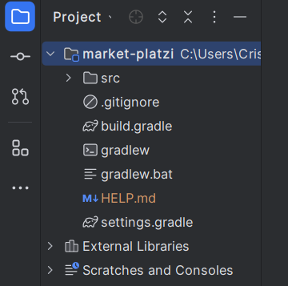

# Curso Spring - Platzi

## Contenedores

Un contenedor es una unidad de software que empaqueta una aplicación junto con:

- Sus dependencias
- Librerías
- Configuraciones
- Datos

en un único paquete facilmente transportable y ejecutable.

### ¿Por qué se crearon?

Los contenedores sirgieron para abordar las necesidad de **aislar** aplicaciones del sistema operativo y permitir que funciones de manera consistente en **diferentes entornos**.

Antes las aplicaciones tenian problemas de:

- Compatibilidad
- Dependian fuertemente de sistema operativo.

### Importancia de los contenedores

**Portabilidad**: Se ejecutan de manera predecible en cualquier entorno, independiente del SO o infraestructura.

**Aislamiento**: Cada contenedor está aislado de los otros, evita conflictos y garantiza que no se afecten entre sí.

**Eficiencia**: Comparten recursos del SO, los hace más livianos y eficientes en comparación con las maquinas virtuales.

**Despliegue Ágil**: Facilitan el despliegue rápido y escalable de aplicaciones, especialmente en la nube.

## Resumen

Los contenedores son una técnica importante para el desarrollo y despliegue de aplicaciones modernas.

- Simplifican la gestión
- Garantizan la coherencia en diversos contextos.

Sus carateristicas clave:

- **Empaquetamiento**: Contiene la aplicación y todas sus dependencias en un solo paquete.
- **Aislamiento**: Cada contenedor tiene su propio espacio aislado para ejecutar la aplicación
- **Portabilidad**: Funcionan de manera predecible en diferentes entornos.

---

## Spring Initilizr

Es una herramienta que simplifica la creación de proyectos Spring Boot al proporcionar:

- Starters
- Autoconfiguración
- Estructura estándar

Esta herramienta permite comenzar rápidamente con proyectos Spring Boot, permitiendo que el desarrollador se concentre en la lógica de negocio en lugar de la infraestructura.

--- 

Una vez descargado el proyecto desde Spring Initializr y cargadas las dependencias, podemos comenzar a editar nuestro proyecto. Para optimizar el entorno de trabajo, es útil ocultar las carpetas que no vamos a utilizar. Para hacerlo, podemos seguir estos pasos:

1. En la raíz del proyecto, hacer clic derecho y seleccionar "Open Module Settings" o presionar la tecla F4.
2. En la ventana de configuración del módulo, dirigirse a la pestaña "Modules".
3. Marcar las carpetas que no vamos a utilizar como "Excluded" y aplicar los cambios.
4. En la barra de herramientas del proyecto, hacer clic en los tres puntos y seleccionar "Apariencia".
5. Asegurarse de desmarcar la opción "Mostrar archivos excluidos".

Estos pasos nos permitirán acceder más fácilmente a las carpetas relevantes para nuestro proyecto y mantener el entorno de desarrollo limpio y organizado.

---

### Anotación @SpringBootAplication

Combina las anotaciones:

- @EnableAutoConfiguration
- @Configuration
- @ComponentScan

Indica una clase de configuración con uno o más @Bean, tambien activa la autoconfiguración y el escaneo de componentes

--- 

### Propiedades de la aplicación

En un proyecto Spring Boot, puede configurarse de varias maneras:

1. **Archivos de propiedades**: 

- Spring Boot maneja un archivo de propiedades para las configuraciones generales de la aplicación.
- Puede usar dos formatos **.yml** y **.properties**

2. **Propiedades personalizadas**:

- Puede definirse propiedades propias en los archivos de configuración.
- Pueden ser accedidas mediante inyección de la clase Environment

3. **Gestión de perfiles**:

- Spring Boot permite definir perfiles según el tipo de despliegue (desarrollo, producción, etc.).
    - application-***{perfil}***.properties o application-***{perfil}***.yml

---

### Estructura por capas orientada al dominio

**Domain**

En esta capa se encuentra la lógica de negocio y los conceptos centrales de dominio.

- dto: Definen las clases que representan los objetos de transferencia de datos entre capas, se utilizan para transportar la información entre el backed y el Fronted.
- repository: Contiene interfaces o clases que defincen la interacción con la base de datos, Consultas y operaciones relacionadas con las entidades de dominio.
- service: Implementa la lógica de negocio. Los servicios interactúan con los repositorios y realizan operaciones especificas.

**Persistence**

Se encarga de la persistencia de datos (Almacenamiento de datos)

- crud: Implementa las operaciones de Crear, Leer, Actualizar, Eliminar para las entidades de dominio.
- entity: Define las clases que representan las entidades de dominio. Estas clases se mapean directamente a tablas en la base de datos.

**Web**

Maneja la interacción con el cliente (API REST)

- controller: Define los controladores que reciben las solicitudes HTTP, procesan la lógica y devuelven las respuestas al cliente.

Esta estructura separa claramente las responsabilidades y facilita el mantenimiento y escalabilidad del proyecto

---

### ¿Qué es JPA?

Es una especificación de Java que proporciona una forma estandarizada de administrar datos relacionales en aplicaciones Java. 

1. **@Entity**

- Anotación utilizada para marcar una clase como una entidad JPA.
- Las entidades representan objetos que se almacenan en la base de datos como registros en tablas.
- Cada entidad generalmente se mapea a una tabla en la base de datos.

2. **@Table**

- Anotación que se coloca en una clase de entidad para especificar el nombre de la tabla correspondiente en la base de datos.
- Puede incluir opciones como el nombre del esquema, índices, etc.

3. **@Column**

- Anotación utilizada para mapear una propiedad de una entidad a una columna específica en la tabla.
- Permite personalizar detalles como el nombre de la columna, su tipo, longitud, etc.

4. **@Id**

- Anotación que marca una propiedad como la clave primaria de la entidad.

5. **@EmbebedId**

- Anotación utilizada cuando la clave primaria de una entidad está compuesta por varias propiedades.

6. **@GeneratedValue**

- Anotación aplicada a una propiedad de clave primaria.
- Indica que el valor de la clave primaria se generará automáticamente

7. **@OneToMany** y **@ManyToOne**

- Anotaciones utilizadas para establecer relaciones entre entidades.

JPA simplifica la interacción con la base de datos y permite que las aplicaciones Java se centren en la lógica del negocio sin preocuparse demasiado por los detalles de persistencia.

---

### Spring Data

Spring Data es un marco de trabajo que forma parte del ecosistema de Spring y tiene como objetivo simplificar el acceso a datos en aplicaciones Java. 

1. Abstracción de la capa de persistencia:

- Proporciona una abstracción sobre diferentes tecnologías de almacenamiento de datos:
    - Bases de datos relacionales
    - Bases de datos NoSQL
    - Servicios en la nube y más.

- Permite que el código de lógica de negocio sea independiente de la implementación subyacente de persistencia.

2. Spring Data JPA

- Proporciona una forma más sencilla de crear aplicaciones basadas en Spring que utilizan JPA para acceder a datos.
- Elimina la necesidad de implementar manualmente las clases DAO al extender interfaces como JpaRepository<>.

3. Métodos CRUD automáticos:

- Al extender las interfaces proporcionadas por Spring Data, como JpaRepository, obtienes automáticamente métodos CRUD (Create, Read, Update, Delete) para acceder a los datos.

Spring Data simplifica la capa de persistencia en aplicaciones Spring, permitiendo a los desarrolladores acceder a datos de manera más eficiente y consistente.

---

